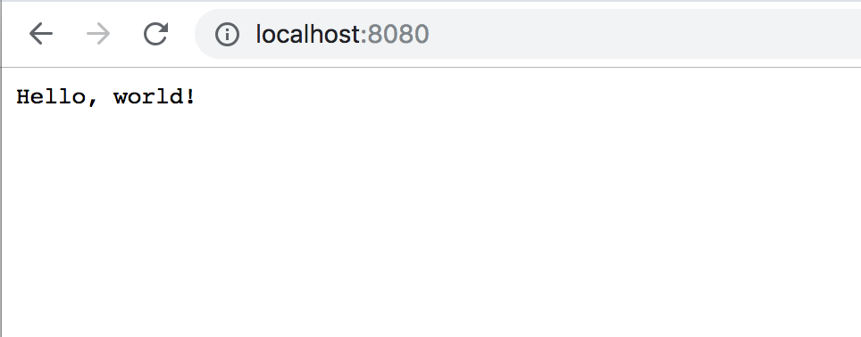

# Superfluous

The most overengineered "hello, World!" app. **Checkout the dev blog [here](https://xercoy.github.io/superfluous/)**



Made with:


# About

Go: web app which responds to requests with hello world
Docker: container that houses Go web server 
Nginx: Reverse proxy to Docker Container
Terraform: create infrastructure
Ansible: configures server created from infrastructure
Bash: scripts representing group of commands to prepare infrastructure


# Motivation

Just a personal project to help me formally use the knowledge I've gained about writing web applications thus far.

# How to Run

This can be run locally or via Docker.

### Running Locally
If Go is installed, `go build` should produce a binary. Execute that binary to start the web server which will be listening on port `8080`.

### Via Docker 
Assuming Docker is installed, there are commands in the Makefile directives set to build and run the server. `make docker-build` will build the image from the Dockerfile and `docker-run` will execute the container. Note: The container will not run in detached mode for now AKA as a "background container". 

## Test if Things are Running

Navigate to the page and you should see:
```
"Hello, world!"
```

via the `curl` command:
```
$ curl 127.0.0.1:8080
> Hello, world!
```
---

# Changelog

**[11/02/2018]**

- initial commit, added basic hello world message.
- added tests, refactored files a bit.
- post #1 done

**[11/03/2018]**

- added Dockerfile, Makefile, gitignore
- added Terraform file

**[11/05/2018]**

- started adding Ansible assets
- started creating bash scripts

# IDEAS

- Post #2: dockerfile, makefile, gitignore
- more testing
- logging
- flags for flexibility (ports, etc)
- dockerfile!
- Helm chart + kubernetes
- GO: something with middleware, something with context, need gracefull shutdown
- SSL? WEBTOKENS?
- API KEY? to enable addition of additional languages when it's database powered
- Secret Store?
- database: migration, setup, separate docker container, etc.
- internationalization (hello world in different languages)
- makefile
- bling (go convey, badges, logo, etc)
- continuous integration
- continuous delivery
- monitoring - prometheus?
- webhooks
- ansible playbook to run, install, etc
- push to dockerhub
- js framework
- have nginx as a framework
- i8n
- pull i8n code into DB
- swagger doc
- circleCI, etc, some random continuous stuff
- benchmark tests and metrics
- logstash!
- database backups
- cron jobs, etc


# Things to learn 

- gitref
- triggering releases